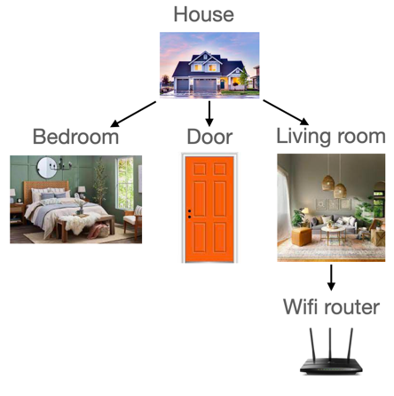

# Tracer
With Kotlin-JVM, KSP and little configuration, Tracer generates extensional properties oriented to 
interior traceable elements, which realizes dependency injection.

## Preview
</img>  
</img>

## See [Tracer Tutorial](https://apollokwok.github.io/TracerTutorial) for more information 